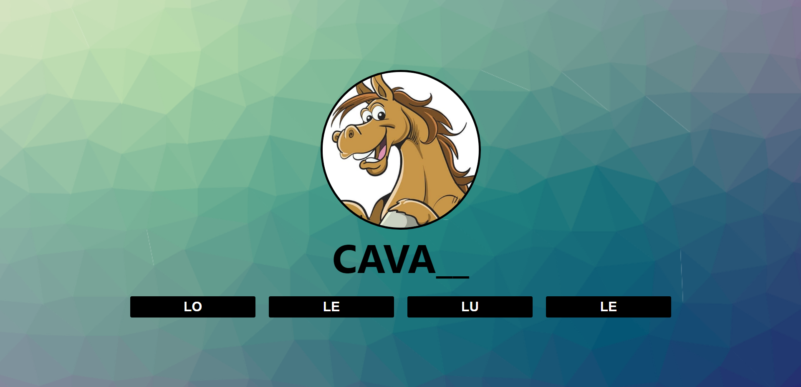
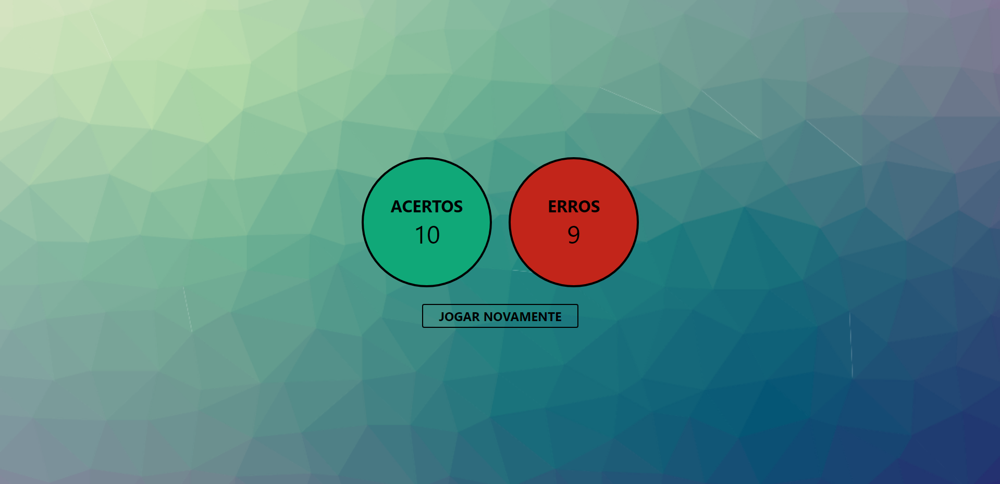

# Sisalabin
O problema de que as crianças não quererem estudar sem se divertir afeta o aprendizado delas em conhecer o mundo e como interagir com ele. O impacto do problema é a criança não ter interesse em aprender e causar um atraso em seu aprendizado e pode causar uma frustração por não saber sobre o mundo e como interagir com ele, podendo descontar essa frustração de alguma forma negativa. Uma solução bem-sucedida incluiria a criança aprender enquanto se diverte, aumentaria a sua curiosidade sobre o mundo e seus elementos, aumentaria seu vocabulário com o aprendizado de novas palavras e sua autonomia em resolver problemas sozinho.

### Stack utilizada

**IDE:** VS CODE 

**TECNOLOGIAS:** 
- HTML5
- CSS3
- JAVASCRIPT
- SASS/SCSS
- GITHUB PAGES

### Video explicativo do jogo
https://youtu.be/xITZv8GMW1g

### Deploy do jogo
https://brunotznr.github.io/HACKATHON-PROJECAO/

### Funcionalidades
- Propor uma nova forma de crianças aprendenrem sobre as sílabas de uma forma divertida

### Oportunidades de negócio
Pode ser usado em escolas ou em casa no aprendizado de crianças a partir de 6 anos para a memorização dos nomes dos animais e da estrutura de seus nomes.

### Aprimoramentos
futuramente irei complementar esse game com mais opções como frutas, objetos e etc, adicionando também um modo em inglês.

### Licença

[MIT](https://choosealicense.com/licenses/mit/)

## Screenshots

- Tela inicial

- Tela do game

- Tela final

